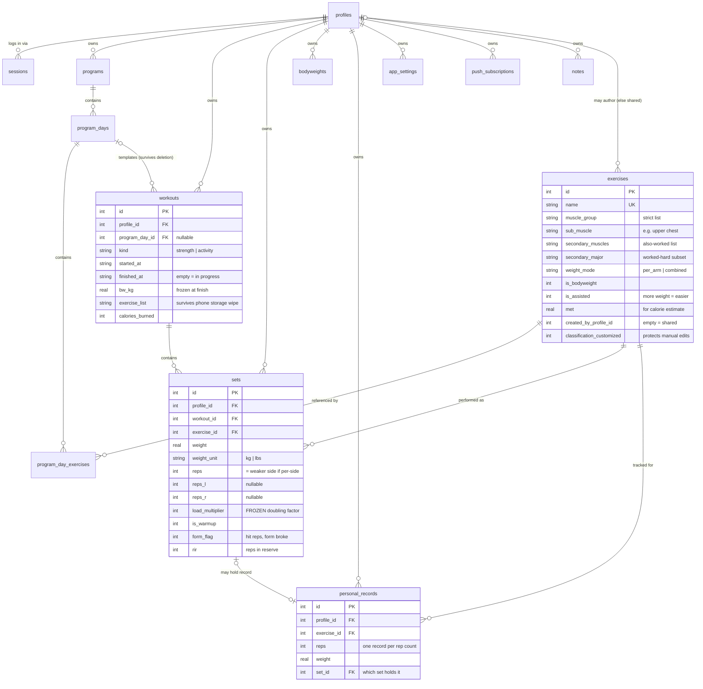
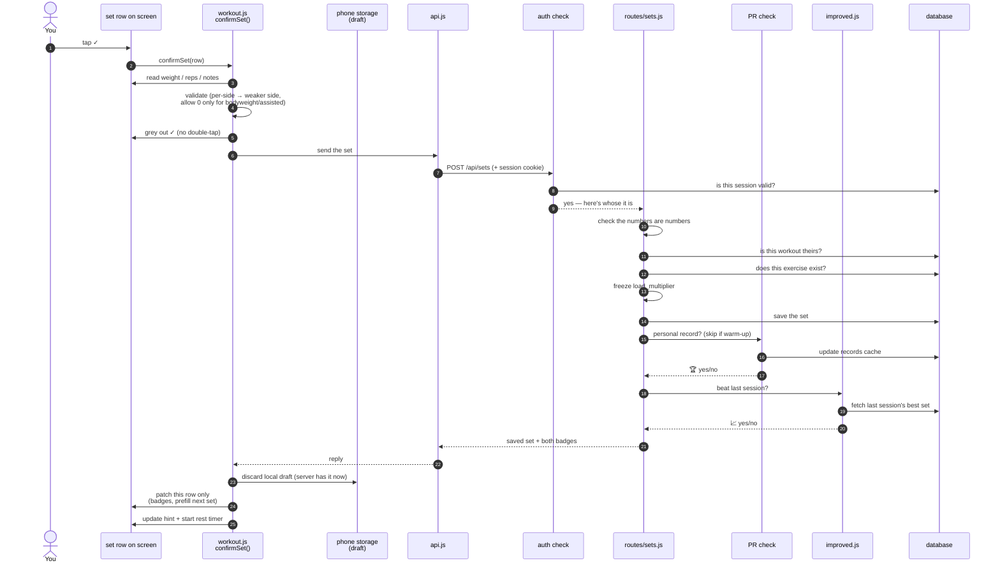
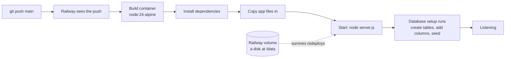

# IronLog — Architecture

> Written for the version at commit `a071b16`. If something here contradicts the code, the code is right — check the date on this file.
>
> **How to read this:** every section starts with a plain-language explanation and a worked example, then goes into the technical detail. If you only want the concepts, read the *"In plain terms"* boxes and the examples and skip the rest.

---

## 1. What it is

IronLog is a phone-first web app for tracking gym workouts. You follow a program (Push/Pull/Legs, Upper/Lower, etc.), log each set with big thumb-sized +/− buttons, and the app tells you what to lift next based on what you managed last time.

It's built as one small server program that keeps all its data in a single file on disk. It's installed on a phone like an app (via "Add to Home Screen"), but it's really a website.

It supports a handful of people — each person has a 4-digit passcode and their own workouts, programs, and body weight. The *list of exercises* is shared between everyone, since "Bench Press" means the same thing to all of them.

Beyond logging, it suggests weight increases, tracks personal records, draws progress charts, estimates calories burned, exports a training log you can hand to a coach, and talks to two other apps (Plated for nutrition, Orbit for admin).

---

## 2. Stack

> **In plain terms:** most modern web apps are assembled from hundreds of third-party building blocks. IronLog uses **three**. Everything else is either written by hand or built into Node.js itself. This is a deliberate choice: fewer moving parts means less to break, less to update, and no "build step" — the code you write is the code that runs.

| Dependency | What it does *here* |
| --- | --- |
| `express` ^4.21 | The web server. It's what turns "someone visited `/api/sets`" into "run this function." `server.js` wires up 15 groups of endpoints and serves the app's files. |
| `compression` ^1.8 | Squeezes responses before sending them over the network. Matters more than usual here because the app re-downloads itself on every cold launch (see the service worker in §5), so that ~600 KB of code travels a lot. |
| `web-push` ^3.6 | Sends the rest-timer notification to your phone even when the app is closed. |
| **`node:sqlite`** (built into Node) | The database. This is *why* the dependency list is so short — Node 22+ ships a database driver, so IronLog doesn't need an external one. No compilation step, which is why the Dockerfile is 6 lines. |
| **Chart.js** (vendored) | Draws the progress graphs. The file is committed directly into the repo at `public/chart.umd.min.js` rather than downloaded from the internet at page load — partly for offline support, partly because the app's security policy (`script-src 'self'`) blocks loading code from other domains. |

**On the front end there is no framework at all** — no React, no Vue. The browser code is plain JavaScript that builds HTML as text strings and drops it into the page. This is unusual for an app this size and is the main reason `public/workout.js` is 140 KB: without a framework to split things into components, related behavior piles into one file.

**Testing:** 24 automated tests run with `node --test`. They cover the maths-heavy parts (personal records, calorie estimates, unit conversions). See §8.5 — the coverage has real gaps.

---

## 3. Directory map

> **In plain terms:** the code splits along two lines. On the server, one file per *kind of thing* (workouts, exercises, programs). On the phone, one file per *tab at the bottom of the screen* (Workout, Programs, Progress, History).

```text
.
├── server.js              Start-up file. Sets up security headers, decides which
│                            URLs need a login, connects everything together.
├── db.js          (103KB) The database: table definitions, upgrades, and the
│                            131 built-in exercises. Biggest file here. See §4.
├── auth.js                Checks "is this person logged in?" on every request.
├── accounts.js            Creating profiles, hashing passcodes, managing logins.
├── pr.js                  Recalculates personal records after an edit or delete.
├── calories.js            Estimates calories burned from sets and activities.
├── push.js                Phone notification plumbing.
│
├── routes/                One file per type of data. Each defines its URLs.
│   ├── auth.js              login / create profile / logout / change passcode
│   ├── exercises.js (24KB)  the exercise catalog
│   ├── programs.js  (22KB)  training templates: programs → days → exercises
│   ├── workouts.js  (29KB)  workout sessions, finishing, history, trends
│   ├── sets.js              logging a set — the busiest code path in the app
│   ├── progress.js  (19KB)  all the charts and analytics
│   ├── plated.js    (17KB)  nutrition-app integration (logs in with a key, not a passcode)
│   ├── orbit.js             admin dashboard feed
│   ├── export.js / import.js   backup download + restore, and the coach-friendly log
│   └── bodyweight, notes, push, settings, bugReport
│
├── lib/                   Logic pulled out of routes so it can be reused/tested.
│   ├── improved.js          Works out "did you beat last session?" for each set.
│   ├── bugReports.js        Catches errors, removes duplicates, forwards to Orbit.
│   ├── orbitReport.js       The actual outbound call to Orbit.
│   └── exerciseLibrary.js   Searching the big reference exercise dataset.
│
├── public/                Everything the phone downloads. Served as-is, no build.
│   ├── index.html           The only HTML page. Four empty sections the tabs fill in.
│   ├── app.js               Start-up: tab switching, lock screen, update prompts.
│   ├── api.js               All server communication funnels through here.
│   ├── utils.js     (74KB)  Shared helpers + the exercise edit forms.
│   ├── workout.js  (140KB)  THE big one — the active workout screen and everything on it.
│   ├── progress.js  (65KB)  Charts, calendar, muscle coverage.
│   ├── history.js   (41KB)  Browsing and editing past workouts.
│   ├── programs.js  (34KB)  Building and editing training templates.
│   ├── settings.js  (33KB)  Settings, export/import, profile management.
│   ├── sw.js                "Service worker" — the bit that makes it installable
│   │                          and work offline. Its VERSION must be bumped on
│   │                          every release (see §8.7 — this is a known trap).
│   └── chart.umd.min.js     The vendored charting library.
│
├── vendor/exercise-library.json   780 KB reference dataset used to fill in
│                                    exercise instructions automatically.
├── data/                  Not in git. The database file and notification keys.
│                            In production this is a Railway "volume" (a disk
│                            that survives redeploys).
└── Dockerfile             6 lines. Describes how to package the app for the server.
```

---

## 4. Data model

### How the database is defined

> **In plain terms:** most projects describe their database in one place, and change it through numbered "migration" files that each run exactly once. IronLog doesn't. It re-runs *all* its setup instructions every single time the server starts, and each instruction checks "have I already done this?" before acting.
>
> **Example:** the instruction to add a `rep_min` column to exercises reads roughly *"if the exercises table doesn't already have a column called rep_min, add one."* On a brand-new database it adds it. On the live database, where it was added months ago, it looks, sees it's there, and does nothing. Run it a thousand times, same result.

That's `db.js`'s `init()`, which runs on every boot and does three things:

1. **Create the original tables** — ~14 `CREATE TABLE IF NOT EXISTS` statements.
2. **Add every column invented since** — ~40 guarded `ALTER TABLE ... ADD COLUMN` calls.
3. **Fill in the built-in data** — the 131 standard exercises and their classifications.

Two tables (`app_settings`, `personal_records`) needed a change SQLite can't do with `ALTER` — changing the primary key. Those get a create-new / copy-everything-over / delete-old / rename dance inside a transaction (`db.js:468-506`).

> ⚠️ **The catch:** the `CREATE TABLE` statements at the top of the file do **not** describe the database as it is today. The `sets` table is declared with 11 columns and actually has 18; `exercises` is declared with 5 and has 20+. To know what a table really looks like you have to read the creation statement *and* mentally apply 400 lines of later additions. This is a genuine readability problem — see §8.3.

### The tables, and why they're shaped that way

**`profiles`** — one row per person. Name, accent colour, and the passcode stored as a *scrypt hash* with a random per-person salt.

> **In plain terms:** the app never stores your actual passcode. It stores the result of scrambling it in a way that can't be reversed. When you log in, it scrambles what you typed and compares the two scrambles. Even someone with full database access can't read your passcode out of it.

**`sessions`** — proof you're logged in. A long random string (the "token") paired with your profile. Lives 30 days.

**`meta`** — global settings that belong to the *app*, not to any person. It exists because of a real bug: certain setup flags were originally stored per-person, which meant the first person to sign up "adopted" them and they never ran again for anyone else.

**`exercises`** — the shared catalog, and the most conceptually loaded table:

- `muscle_group` — a strict list: chest, back, shoulders, biceps, triceps, forearms, legs, core. Anything else is rejected.
- `sub_muscle` — the finer detail, e.g. "upper chest", "long head".
- `secondary_muscles` — other muscles the exercise also works, stored as a list.
- `secondary_major` — a *shorter* list: which of those get worked hard enough to really count.

> **Example — why two lists:** a Bench Press primarily works your chest. It also works your front shoulders and triceps meaningfully, and your forearms a tiny bit just from gripping the bar.
>
> - `secondary_muscles` = `["front delt", "triceps", "lateral head"]` — everything it touches. Used for "when did I last train my triceps?"
> - `secondary_major` = `["front delt"]` — only what's worked hard enough to count toward "have I hit shoulders twice this week?"
>
> Without the split, gripping a bar would count as a forearm workout.
>
> There's a third state that matters: if `secondary_major` is **empty**, that means "credit nothing." If it's **not set at all**, that means "we haven't classified this yet — credit everything," which is the old behaviour kept for exercises that predate the feature. Empty and unset look similar but mean opposite things.

- `weight_mode` — `per_arm` or `combined`. Whether the number you type is one hand's weight or the total. (This one is subtle enough to have its own section below.)
- `is_bodyweight` / `is_assisted` — these flip the maths. An assisted pull-up machine *takes weight off you*, so more weight on the stack means it's **easier**. Effective load is `your bodyweight − assistance`, the reverse of every other exercise.
- `created_by_profile_id` — empty means "built-in, shared by everyone"; filled in means "someone's personal custom exercise, only they can edit it."
- `classification_customized` — a flag meaning "a human deliberately set this exercise's muscle group." Essential, because the built-in setup instructions re-run on every boot and would otherwise overwrite deliberate edits. See §8.2.

**`programs` → `program_days` → `program_day_exercises`** — the template hierarchy.

> **Example:** a program called "Push/Pull/Legs" contains three days. The "Push" day contains Bench Press (3 sets × 8), Overhead Press (3 × 10), and so on. Each of those slots stores the *prescription* — how many sets and reps you're aiming for on that day — which is separate from the exercise's own preferred rep range.

Only `programs` records who owns it; days and exercises inherit ownership through their parent, and are automatically deleted with it.

**`workouts`** — one row per gym session. Also handles non-gym sessions (a run, a class) via `kind = 'activity'`, which reuse the same table so they show up on the consistency calendar for free.

Two fields worth understanding:

- `bw_kg` — a **snapshot of your body weight**, taken when you finish the workout.

  > **Why:** if you do 10 pull-ups at 80 kg bodyweight, that's 800 kg of work. If the app looked up your *current* weight every time it drew a chart, then losing 5 kg would silently rewrite last year's pull-up numbers downward. Freezing the value at finish time means history stays true.
  >
  > **Gotcha:** it's empty for the whole time a workout is still in progress, since you haven't finished yet. Code that runs mid-workout has to handle that — this caused a real bug (see the fallback in `lib/improved.js`).

- `exercise_list` — a saved copy of the workout's exercise list after mid-session swaps. Exists because this used to be stored only on the phone, and iPhones clear that storage aggressively — people would swap an exercise, background the app, come back, and find their swap undone.

**`sets`** — the core record: weight, unit, reps, attached to a workout.

> **Why sets attach to the workout and not the program slot:** a set has to outlive its template. You might swap an exercise mid-workout, delete the whole program next month, or do a quick unplanned session with no program at all. In every one of those cases, the set still describes something that genuinely happened in a gym. Attaching it to the *workout* means it only depends on facts that can never be retracted. Deleting a program can never delete your history.

Notable columns:

- `load_multiplier` — the per-arm doubling factor (2 or 1), **frozen at the moment you logged the set**. Covered in detail below.
- `reps_r` / `reps_l` — optional per-side reps, for when your right arm gets 9 and your left gets 7. When both are filled in, the main `reps` value is forced to the *weaker* side, so every calculation downstream keys off the honest number without needing to know these columns exist.
- `is_warmup` — warm-ups count as done but never toward personal records or progression.
- `form_flag` — "I hit the reps but my form fell apart." The set counts, but the app won't suggest a weight increase off it.
- `rir` — "reps in reserve," how many more you could have done.
- `rpe` — **dead column.** Nothing writes it any more; old rows have leftover values (often 0) that the export code deliberately ignores so a coach doesn't read "RPE 0/10" as real.

**`personal_records`** — a *cache*, rebuilt from raw sets whenever anything changes.

> **Example:** it's keyed by rep count, so 100 kg × 5 reps and 90 kg × 8 reps are **both** personal records, stored separately. That's intentional — they're different achievements. `set_id` records exactly which set holds each record, because matching on the numbers alone meant that any later set *tying* your record also showed the trophy badge.

**Also:** `bodyweights`, `app_settings`, `push_subscriptions`, `notes`, `bug_reports`.

### The weight_mode / load_multiplier problem — worked example

This is the most interesting design decision in the codebase, so here it is concretely.

You do an Incline Dumbbell Press holding a 20 kg dumbbell in each hand. What do you type into the app — `20` or `40`?

IronLog says: type `20` (one dumbbell), and it marks the exercise `weight_mode = 'per_arm'` so it knows to double the number when calculating how much work you did. Your volume counts as 40 kg per rep.

**Now the trap.** Suppose that setting is wrong — the exercise is marked `per_arm` but you've been typing `40` (the combined total) all along. The app doubles it to 80 kg. Every volume chart for that exercise has been **twice the truth** for months, with nothing visibly wrong on screen.

**The naive fix makes it worse.** If the doubling factor were only ever read from the exercise's current setting, then flipping that setting to correct it would retroactively rewrite *every historical set* — including all the ones you logged correctly.

**The actual solution:** each set stores its own copy of the doubling factor (`load_multiplier`) at the moment it's created. History becomes immutable — flipping the setting only affects sets logged from that point on.

**And then the human problem:** but sometimes the setting really *was* wrong from day one, and you genuinely want the old sets corrected. So (added in commit `a071b16`) flipping the toggle now asks: *"Fix past sets too?"* — an explicit, opt-in choice, scoped to only your own sets, since the exercise catalog is shared and someone else may have been logging it correctly all along.

### Entity relationship diagram



---

## 5. What happens when you log a set

> **In plain terms:** this is the app's most-used action, and it touches almost every interesting mechanism — so it's the best single thing to follow end to end. Below is the same journey told twice: once in plain language, then with the actual file names and functions.

### The plain-language version

You've done your set. You tap the ✓ button.

1. The app reads what's in the weight and reps boxes right there on screen.
2. It sanity-checks them. *(Empty reps? Refuse. Weight of 0? Normally refuse — but allow it for pull-ups and assisted machines, where zero is meaningful: zero added weight, or zero assistance, which is the hardest version.)*
3. It greys out the ✓ so you can't accidentally double-tap and log the set twice.
4. It sends the set to the server.
5. The server checks you're logged in, checks this workout is actually *yours*, and checks the numbers are really numbers.
6. It saves the set, then works out two things: **is this a personal record?** and **did you beat last session?**
7. It sends both answers back.
8. Your phone updates just that one row — adding a 🏆 or 📈 badge if earned — without redrawing the whole screen, so nothing jumps around under your thumb. It copies the weight into the next set's box, moves the "you're here" highlight down, and starts your rest timer.

Two details worth knowing:

**Your typing is saved as you go.** Every keystroke is mirrored into the phone's local storage. If your phone locks between sets, or the app gets backgrounded and reloaded, your half-entered set is still there. Once it's saved to the server, that local copy is thrown away.

**The rest timer knows about supersets.** If this exercise is paired with another one, the timer *doesn't* start — because you're supposed to go straight into the partner exercise, and starting a rest countdown would contradict the "go straight into it" text on screen.

### The technical version

| # | Where | What happens |
| --- | --- | --- |
| 1 | `workout.js:wireWorkoutView()` | One click handler on the whole screen (not one per row) matches `[data-confirm]` and calls `confirmSet(row)`. |
| 2 | `workout.js:confirmSet()` (line 1677) | Reads values straight from the DOM — for unsaved rows, the DOM *is* the state. Reconciles per-side reps to `MIN(left, right)`. |
| 3 | `api.js:api()` | `POST /api/sets`. Adds a 30-second timeout. Retries once on gateway errors — **but only for safe methods**; a POST is deliberately excluded, since retrying could create a duplicate set if the first one actually succeeded and only the reply got lost. |
| 4 | `auth.js:requireProfile` | Already ran via `server.js:114`. Read the `il_session` cookie, resolved it to a profile, set `req.profileId`. |
| 5 | `routes/sets.js:91` | The strictest validation in the codebase — because SQLite will happily store the text `"abc"` in a number column if you let it. Verifies the workout belongs to this profile (`WHERE id = ? AND profile_id = ?`), the exercise exists, and every number is a real number. |
| 6 | same file | `INSERT INTO sets`, then snapshot `load_multiplier` from the exercise's current `weight_mode`. |
| 7 | `checkAndUpdatePR()` | Estimates a one-rep-max equivalent, **flips the sign for assisted exercises** so "better" means less assistance, applies a 0.1% threshold to avoid rounding-noise records, updates `personal_records`. Warm-ups skip this. |
| 8 | `lib/improved.js` | Finds the most recent *finished* prior session for this exercise, takes its best set, compares. Only the first qualifying set per exercise per session gets flagged. |
| 9 | back in `confirmSet` | Response pushed into `workoutState.loggedSets`, the in-memory mirror. Row patched in place. `cascadePrefillSiblings()`, `moveNextHighlight()`, `refreshProgressionHint()`, `startRestCountdown()`. |

> ⚠️ **The three-render-paths trap.** Because the row is patched *in place* rather than redrawn, any badge must be written into **three** separate places: `setRowHTML()` (full redraw), `reconcileSetRowBadges()` (warm-up toggle), and `confirmSet()`'s in-place patch. Wire it into only one and it silently vanishes the moment a different path runs. This has been a recurring bug. The cause is the lack of a UI framework — normally the framework guarantees the screen matches the data, and here nothing does.



---

## 6. Auth (logging in)

> **In plain terms:** there are no usernames. You type a 4-digit code, and the app figures out who you are *from the code itself*. That's why two people can't share a passcode — the app would have no way to tell them apart.

### What actually happens when you type your passcode

1. You tap 4 digits on the lock screen.
2. The app sends just those 4 digits to the server.
3. The server takes your code, scrambles it, and compares the scramble against every profile's stored scramble until one matches. *(Scrambling is one-way — the server can check a code is right without ever knowing what it is.)*
4. On a match, the server generates a long random string, saves it as a "session," and sends it back as a cookie your phone stores.
5. Every later request automatically includes that cookie. The server looks it up to know who you are.

**If no profile matches**, the app doesn't just show an error — it assumes you might be a new person and offers to create a profile with that code. There's no separate sign-up screen.

**The cookie is `HttpOnly`**, meaning JavaScript running in the page can't read it. If someone managed to inject malicious code into the app, they still couldn't steal your login token.

**Sessions last 30 days**, enforced by checking the creation date at lookup time rather than by any expiry timer. Logging out is just deleting the row.

### How routes get protected

Essentially one line does it — `server.js:114`:

```js
app.use('/api', requireProfile);
```

> **In plain terms:** everything defined *after* this line requires a login. Everything defined *before* it is public. It's a horizontal line through the file, and where a route sits relative to it determines whether it's protected.

Five things sit deliberately above the line:

| Public route | Why it must be |
| --- | --- |
| `/health` | The hosting platform pings it to check the app is alive. It has no login to offer. |
| `/api/auth` | Chicken-and-egg — you can't require a login on the thing that gives you a login. Its own `/me` and `/logout` sub-routes guard themselves individually. |
| `/api/plated` | The nutrition app isn't a person and has no passcode. It authenticates with a secret key in a header instead. |
| `/api/orbit` | Admin dashboard, uses its own separate key. |
| `/api/bug-report` | Must work *before* login — crashes on the lock screen are exactly the ones worth reporting. Uses a check that identifies you if it can but never rejects you. |

**When an unauthenticated request arrives:** the server replies `401 authentication required`. On the phone, `api.js` catches *any* 401 anywhere in the app and shows the lock screen. So if your session expires mid-workout, you get bounced to the numpad rather than watching things silently fail.

**Brute-force protection:** login attempts are rate-limited per IP address and globally, both on 15-minute windows. `server.js` is configured to trust exactly one proxy hop (Railway's), so an attacker can't fake their IP address to escape the limit.

---

## 7. Deployment

> **In plain terms:** you push code to GitHub. Railway notices, packages the app into a container, and starts it. The database lives on a separate disk that survives redeployment — without that, every update would wipe all your data.



**Build:** Railway auto-detects the `Dockerfile` — there's no Railway-specific config file. The Dockerfile is 6 meaningful lines. **There's no build step** because there's nothing to compile: the browser code ships exactly as written.

**Database upgrades happen at start-up, not as a separate command.** `server.js` calls `init()` before it starts listening. Because every instruction is self-checking (§4), this is safe to repeat forever. There's no "migrate" command to remember and no rollback.

**Persistence:** the database file sits on a Railway *volume* mounted at `/data`.

> ⚠️ This is load-bearing. A container's own filesystem is thrown away on every deploy. Without the volume, every single update would silently reset the app to an empty database.

Because that volume is network-attached storage (slower than a local disk), `db.js` sets `synchronous = NORMAL` — a documented trade that avoids forcing a disk-sync on every single set you log. Combined with WAL mode, a crash can lose the last commit but can't corrupt the file.

**Environment variables** (names only, no values):

| Variable | Set by | What happens if it's missing |
| --- | --- | --- |
| `PORT` | Railway, automatically | Falls back to 3000. |
| `DB_PATH` | The Dockerfile | Falls back to a local folder — **which on Railway means data loss on redeploy.** |
| `NODE_ENV` | The Dockerfile | Error messages leak internal details; login cookie loses its HTTPS-only flag. |
| `ADMIN_CODE` | You, in Railway | **A random code is generated per restart and printed once to the logs.** It changes on every deploy. |
| `ORBIT_API_KEY` | You | The admin feed rejects everything except requests from the server itself. |
| `ORBIT_URL`, `INGEST_SECRET` | You | Bug reports still saved locally, just never forwarded. |
| `VAPID_PUBLIC_KEY` / `VAPID_PRIVATE_KEY` | You | Auto-generated to a file. Fine *if* that file is on the volume — otherwise notification keys rotate on redeploy and everyone's existing subscriptions silently break. |
| `VAPID_CONTACT` | You | Falls back to a hardcoded email in `push.js`. |
| `PLATED_ORIGIN` | You | Controls which domain may call the nutrition integration. |

---

## 8. Known weaknesses

Ordered by what could actually cause harm, not by how easy each is to explain.

---

### 8.1 A real production key is committed into the source code

**What it is:** `accounts.js:11` contains a live 64-character API key written directly into the code as text.

**Why it's a problem, concretely:** anyone who can read the repository has a working key to the Plated integration on the live app. And because it's in git history, deleting the line today doesn't remove it — every past version of the file still contains it, forever, in every clone anyone has ever made.

The damage is bounded — that key accesses one profile's nutrition data (mostly reads, plus a body-weight write), not the whole app. So this isn't catastrophic. But it's the one actual secret sitting in source code, and if this repo ever becomes public it's immediately exposed.

**Roughly what fixing it involves:** generate a fresh key (there's already a button for this in Settings), move the old value into an environment variable read at start-up, and either rewrite git history or accept that the old key must be permanently revoked. Since the migration it supports was a one-time event that already happened, the cleanest fix might be deleting the mechanism entirely.

---

### 8.2 Setup instructions re-run forever, and can silently undo your edits

**What it is:** the built-in exercise data is re-applied every time the server starts. Some of those instructions *update* existing exercises' muscle classifications. The only thing stopping them from overwriting deliberate manual edits is a flag (`classification_customized`) that each instruction has to individually remember to check.

**Why it's a problem, concretely:** imagine you correct an exercise — you decide "Cable Crossover" should be classified as lower chest rather than mid chest. You save it. It looks right. Then two weeks later, a completely unrelated deploy happens, the setup instructions re-run, and one of them doesn't check the flag. Your correction silently reverts. There's no error, no warning, no log entry. The data just quietly changes back, and you probably won't notice for weeks.

This has already happened at least once — the flag exists *because* of it. The design relies on every future person (including you in six months) remembering an unwritten rule.

There's a related trap: deliberately choosing "whole muscle" saves an empty value, which looks *identical* to "never classified." Without the flag there is literally no way to tell a deliberate choice from an untouched default.

**Roughly what fixing it involves:** the proper fix is real one-time migrations — a table that records which instructions have already run, so data changes execute exactly once instead of on every boot. That's a meaningful rework of half of `db.js`. A cheaper middle step: funnel all classification updates through a single helper that has the safety check baked in, so it's structurally impossible to forget rather than merely inadvisable.

---

### 8.3 You can't tell what the database looks like by reading the database file

**What it is:** `db.js` declares each table's original shape, then adds ~40 columns across several hundred lines of separate instructions.

**Why it's a problem, concretely:** to answer "what columns does the `sets` table have?" you have to read the creation statement, then scan 400 more lines applying additions in order. In practice people don't — they guess, and guesses go wrong: writing a query against a column that doesn't exist, or missing a critical one like `load_multiplier` and accidentally halving everyone's volume numbers.

It also makes changes impossible to review properly. Adding a column shows up as one line buried in the middle of a 103 KB file, not as a visible change to a schema definition.

**Roughly what fixing it involves:** two independent, low-risk moves. Split `db.js` into separate files for schema, migrations, seed data, and shared query fragments — mechanical work, big readability payoff. Then generate a `schema.sql` snapshot as part of the release process, so the *current* shape of every table is one greppable file even though migrations remain the source of truth.

---

### 8.4 A wrong per-arm setting corrupts your charts invisibly

**What it is:** whether a typed number means "one dumbbell" or "both" is a setting, and nothing checks that the setting matches what you're actually doing.

**Why it's a problem, concretely:** if the setting is wrong, every volume chart, weekly total, and muscle-coverage number for that exercise is off by exactly double — in a way that looks completely normal on screen. You'd have no reason to suspect it. It could persist for months.

This isn't theoretical; it's the real reported issue behind commit `a071b16`. That commit made the problem *correctable*, but detection is still entirely manual — you have to notice and reason about it yourself.

**Roughly what fixing it involves:** the data needed to spot it automatically is already there. A dumbbell exercise whose logged weight suddenly halves or doubles on a specific date, or whose per-arm load is wildly out of line with your other dumbbell lifts, is a strong signal. There's already a feature doing exactly this pattern for kg/lbs mix-ups (`/api/sets/unit-outliers`) that could be extended. Alternatively, show the *effective* load — the number that actually counts toward volume — right on the set row, so a doubling error is obvious while logging rather than invisible in a chart months later.

---

### 8.5 Almost nothing about the server or the UI is tested

**What it is:** 24 tests, all covering pure calculations — personal records, calorie maths, unit conversion. **Zero** tests for any server endpoint, any login path, or any browser code.

**Why it's a problem, concretely:** the untested part is exactly where the real bugs have been. Nothing verifies that every database query filters by profile — and a single missing filter is a privacy breach where one person sees another's workouts. Nothing verifies the login gate is positioned correctly in `server.js`. Nothing verifies that backup export and restore actually round-trip. These are currently checked by manually driving a browser, which is slow enough that it gets skipped.

The browser code is the harder half: `workout.js` is 140 KB where the decision-making logic (should we suggest more weight? is this a plateau?) is tangled together with code that writes to the screen, so there's no clean seam to test against.

**Roughly what fixing it involves:** the highest-value first step is endpoint tests against a temporary in-memory database — create two profiles, then assert that profile A cannot read or modify *anything* belonging to profile B through any endpoint. That's a few dozen tests locking down the property most likely to cause real harm. Second: lift the pure decision functions out of `workout.js` into their own file. They already have no screen dependencies — they're just sitting next to code that does — so this is mostly a cut-and-paste that makes the progression logic testable without a browser.

---

### 8.6 One database file, one disk, and backups are a button someone has to remember to press

**What it is:** all data lives in a single file on a single disk. The only backup is a manual "Export to JSON" button in Settings.

**Why it's a problem, concretely:** if that disk is lost or the file is corrupted, you lose everything back to whenever you last remembered to tap Export. There's no schedule, no copy stored anywhere else, and — importantly — no one has ever tested restoring from one. An untested restore isn't really a backup; plenty of people discover their backup format is broken only at the moment they need it.

Separately, the `synchronous = NORMAL` setting (a reasonable speed trade-off, see §7) means a hard crash can lose the most recent write — which in this app means "the set you just logged."

> **What is *not* a problem here:** SQLite's ability to handle the load. A handful of household users is nowhere near its limits, and this is a common misconception. Don't let "SQLite doesn't scale" drive a rewrite — the backup gap is the real risk, and it would exist with any database.

**Roughly what fixing it involves:** a scheduled job that calls the existing export endpoint and pushes the file to cloud storage would close most of the gap using code that already exists. Better is SQLite's built-in `VACUUM INTO` for a proper consistent snapshot, or a tool like Litestream that continuously streams changes to cloud storage and gives point-in-time recovery — roughly a config-and-sidecar change. Whichever route, the restore needs to be practised at least once, on purpose, before it's needed.

---

### 8.7 Two version numbers must be updated together by hand

**What it is:** `public/sw.js` and `public/bugreport.js` each contain a version string, and both must be changed identically on every release that touches browser code.

**Why it's a problem, concretely:** two silent failure modes.

- **Forget the one in `sw.js`:** phones keep serving the old cached code. You deploy a fix, look at your phone, and the bug is still there — with no error to explain why. You end up debugging code that isn't even running.
- **Forget the one in `bugreport.js`:** every bug report gets stamped with the wrong version. You then investigate a bug "in v195" that was actually fixed in v195 and reported from a phone still on v194. This has already caused real confusion — a batch of reports arrived tagged with a superseded version.

**Roughly what fixing it involves:** derive both from one place. Given there's no build step, the simplest option is a small `/api/version` endpoint reading the version out of `package.json`, which the reporting code fetches at start-up. The service worker still needs a literal string, so pair it with a pre-deploy check that fails loudly if the two constants don't match — turning a silent failure into an obvious one.

---

## The five things hardest to explain cold

If someone put you on the spot, these are where your understanding is thinnest — ordered by how likely they are to come up *and* how easy it'd be to get caught out.

**1. Why the doubling factor is stored twice — on the exercise *and* on every set.**
It sounds like pointless duplication until you can name the failure it prevents. Reading it from the exercise means the number is interpreted at *chart-drawing* time, so changing the setting silently rewrites years of history. Freezing a copy onto each set at *logging* time makes the past immutable. Be ready for the obvious follow-up — *"then how do you fix a setting that was wrong all along?"* — because the answer (an explicit opt-in retroactive fix, scoped to just your own sets) is what shows you understood the trade-off rather than just dodged it.

**2. Why one badge has to be written in three different places.**
Easy to state, hard to justify. The reason is that the set row is deliberately patched in place rather than redrawn, so the screen doesn't jump under your thumb while you're mid-workout — and that UX decision is paid for in code duplication. Without a UI framework, nothing guarantees the screen matches the data, so each of the three ways a row can update has to be taught about every badge independently. It's the clearest example in the project of an architectural choice with an ongoing tax.

**3. The two overlapping muscle lists, and why "empty" and "not set" mean opposite things.**
`secondary_muscles` is everything an exercise touches; `secondary_major` is the subset worked hard enough to count. On top of that there's a three-state rule: *unset* means "credit everything" (a fallback for old data), *empty* means "credit nothing," and a filled list means exactly what it says. Empty and unset look nearly identical in the database and behave in opposite ways. Answering "what does this exercise contribute to my back training?" requires knowing both columns *and* that rule.

**4. Where the login boundary sits, and the five things deliberately outside it.**
"One line protects every endpoint" is the easy half. The interesting half is *why* five routes sit above that line, each for a different reason — the health check has no login to give, the login endpoint can't require a login, the nutrition app isn't a person and uses a key instead, the admin feed uses a different key again, and bug reporting must work before you've logged in because lock-screen crashes are the ones most worth catching. Explaining why three different authentication mechanisms coexist is what demonstrates you know the file rather than the concept.

**5. That the database setup re-runs on every single restart — and what that causes.**
Most people's mental model is "migrations run once, tracked somewhere." Here they run unconditionally on every boot, made safe only by each one checking its own work first. The non-obvious consequence is that instructions which *modify* data (not just add columns) re-execute forever — which is the entire reason the `classification_customized` flag exists. Connecting "there's no migrations table" to "a user's manual edit can silently revert on an unrelated deploy weeks later" is the thing most likely to catch you out, because those two facts live hundreds of lines apart in the same file.
